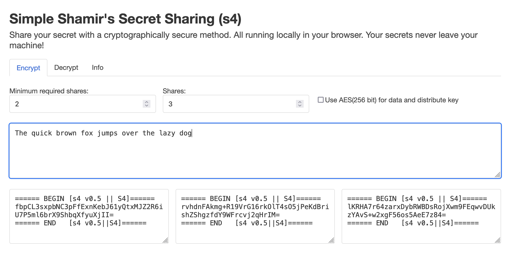
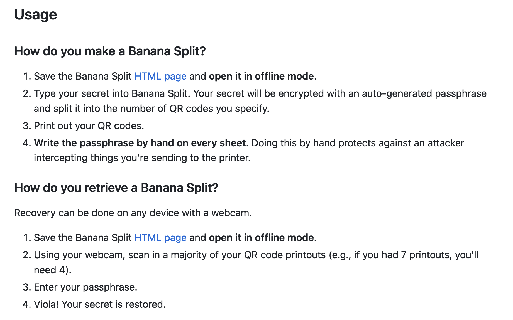
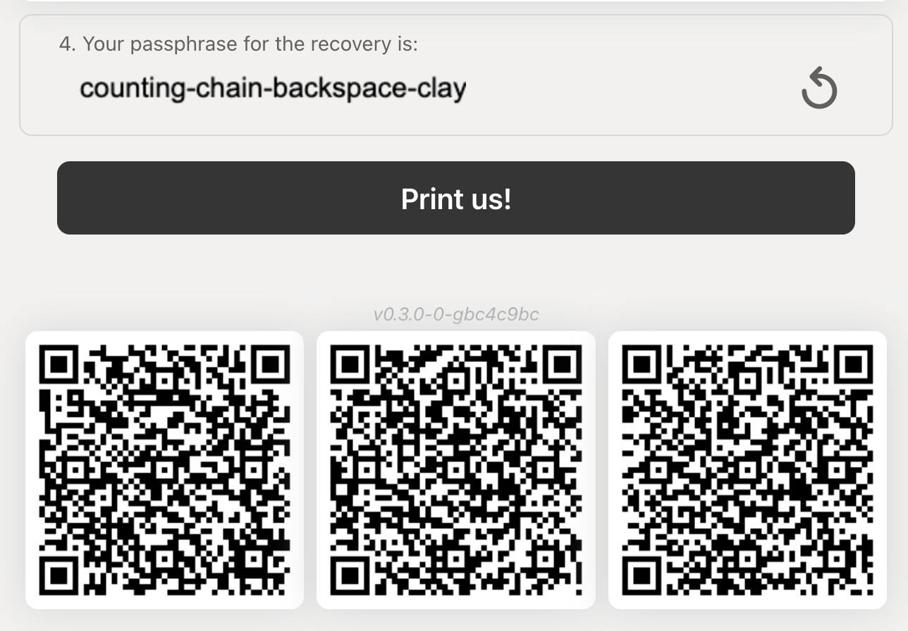

# Read-Only Offline Crypto Device Recipe - FAQs

### Why Raspberry Pi And Why 400?

The parts are simple, readily available and cheap enough to make redundant backups.

There are no moving components (fans, disk drives) and should have a long lifespan.

The software is well supported, and documentation is easily accessible.

The fully prepared MicroSD card is cheap and can easily be duplicated and distributed.

The 400 comes in convenient keyboard case - two less things to worry about.

### What Is So Cool About This Recipe?

When running this device using the Overlayroot mode, any secrets generated in your use of this tool is lost when you power down this device. The Linux operating system overlays writes to Random Access Memory (RAM), while keeping the contents of the MicroSD card as read-only.

Note that you will still need a secure HDMI connected computer monitor to use this tool securely.

### What Is Overlayroot?

[Overlayroot](https://spin.atomicobject.com/protecting-ubuntu-root-filesystem/) is used by the Raspberry Pi OS to create a read-only filesystem.

### Is This Different From Trezors Shamir Backup?

Yes. Trezor have their own Shamir backup system requiring different tools - see [What is Shamir backup?](https://trezor.io/learn/a/what-is-shamir-backup). You can still use this device on your Trezor's BIP-39 mnemonic seed phrase.

### How Do I Remove The Read-Only Mode?

See [here](https://core-electronics.com.au/guides/read-only-raspberry-pi/) and [here](https://learn.adafruit.com/read-only-raspberry-pi/overview) for steps.

### What Is BIP-39?

See the official [BIP-39 specification](https://github.com/bitcoin/bips/blob/master/bip-0039.mediawiki) and [What is BIP39?](https://trezor.io/learn/a/what-is-bip39).

### What Is Shamir39?

See the [Shamir39 specification](https://github.com/iancoleman/shamir39/blob/master/specification.md). There is only one known implementation of this specification at https://github.com/iancoleman/shamir39 by the same author.

### What Is Shamir's Secret Sharing?

See [Dev Corner: A Detailed Guide to Shamir Backup](https://blog.trezor.io/shamir-backup-a-new-security-standard-3aa42a6ebb5f).

### What Wallets Support BIP-39?

Here are some wallets. Check the individual models for specifics:

| Wallet | Type | BIP-39 Support? |
| --- | --- | --- |
| [Gridplus Lattice1](https://gridplus.io/products/grid-lattice1) | Hardware | [Yes](https://docs.gridplus.io/lattice1/security-features/lattice1-random-number-generation) |
| [Ledger](https://www.ledger.com/) | Hardware | [Yes](https://support.ledger.com/hc/en-us/articles/4415198323089-How-Ledger-device-generates-24-word-recovery-phrase?docs=true) |
| [MetaMask](https://metamask.io/) | Software | [Yes](https://support.metamask.io/hc/en-us/articles/4404722782107-User-Guide-Secret-Recovery-Phrase-password-and-private-keys) |
| [Trezor](https://trezor.io/) | Hardware | [Yes](https://trezor.io/learn/a/what-is-bip39) |

### What Other Tools Could Be Useful For This Read-Only Offline Device?

#### Simple Shamir's Secret Sharing

Simple Shamir's Secret Sharing (s4) at https://simon-frey.com/s4/ allows you to encrypt and decrypt messages. Save a copy of the web page in your Downloads folder before you remove the network connectivity and set the device to read-only mode.

A backup of the contents of the link https://simon-frey.com/s4/ has been made to [copy/Simple Shamir's Secret Sharing (s4).html](copy/Simple%20Shamir's%20Secret%20Sharing%20(s4).html), just in case.



You may have to distribute these shares by copying them onto USB storage, as these shares are much harder to write down.

Research and test yourself before real use!

#### Banana Split

Banana Split at https://github.com/paritytech/banana_split splits secrets (maximum length 1024 characters) into QR code shares for printing, with an additional handwritten passphrase required to recover your original secret.



NOTE: You will need a [camera](https://www.raspberrypi.com/products/camera-module-v2/) for your Raspberry Pi device to restore your secret from the QR codes. You may be able to use USB webcams as well. I have not tested that this will work.




A backup of the contents of the link https://bs.parity.io/ has been made to [copy/BananaSplit.html](copy/BananaSplit.html), just in case.

Research and test yourself before real use!

#### Vanity-ETH

Vanity-ETH at https://vanity-eth.tk/ (Note: use the online version only for testing) allows you to generate vanity Ethereum addresses. You can used this to generate an Ethereum private key and public key pair, or a password protected .json keystore file.

The web browser based JavaScript generation process is slow on the Raspberry Pi, at about 5 addresses per second, so I would not bother trying to generate vanity addresses with this setup. Also note that groups of matching vanity addresses can leak information.

You can download the offline version https://github.com/bokub/vanity-eth/archive/refs/heads/offline.zip and extract the file vanity-eth.html from the downloaded vanity-eth-offline.zip into your Downloads folder.

A backup of the contents of the archive vanity-eth-offline.zip from the link https://github.com/bokub/vanity-eth/archive/refs/heads/offline.zip has been made to [copy/vanity-eth.html](https://raw.githubusercontent.com/bokkypoobah/ReadOnlyOfflineShamir39DeviceRecipe/main/copy/vanity-eth.html), just in case.

Research and test yourself before real use!

### How Can I Trust The Downloaded Copies In This GitHub?

The backups in the [./copy](./copy) folder are taken just in case the original links are taken down, or renamed in the future.

If you plan on relying on the these backups, download the files from the original links and download the files from [./copy](./copy), then use a tool to compare them.

| Original Links | Navigate To Copy And Download Raw |
| --- | --- |
| https://bs.parity.io/ | [copy/BananaSplit.html](copy/BananaSplit.html) |
| https://simon-frey.com/s4/ | [copy/Simple Shamir's Secret Sharing (s4).html](copy/Simple%20Shamir's%20Secret%20Sharing%20(s4).html) |
| [https://github.com/iancoleman/shamir39/raw/b12d...d973/standalone.html](https://github.com/iancoleman/shamir39/raw/b12d58d6d71a4db71ac9796e7d82c0a7691dd973/standalone.html) | [copy/standalone_iancoleman_shamir39_b12d...d973.html](copy/standalone_iancoleman_shamir39_b12d58d6d71a4db71ac9796e7d82c0a7691dd973.html) |
| contents of the archive vanity-eth-offline.zip from the link https://github.com/bokub/vanity-eth/archive/refs/heads/offline.zip | [copy/vanity-eth.html](copy/vanity-eth.html) |


Note that you may find some differences in the downloaded `copy/Simple Shamir's Secret Sharing (s4).html` file as there are some active JavaScript menu selection changes when you download the file:

```
$ diff Simple\ Shamir\'s\ Secret\ Sharing\ \(s4\)_FromCopy.html Simple\ Shamir\'s\ Secret\ Sharing\ \(s4\)_FromLink.html | more
218c218
< <li class="" data-section="encrypt">Encrypt</li>
---
> <li class="active" data-section="encrypt">Encrypt</li>
220c220
< <li data-section="info" class="active">Info</li>
---
> <li data-section="info">Info</li>
223c223
< <div id="error" style="display: none;">
---
> <div id="error">
227c227
< <section id="encrypt" style="display: none;">
---
> <section id="encrypt">
245c245
< <section id="decrypt" style="display: none;">
---
> <section id="decrypt">
255c255
< <section id="info" style="display: block;">
---
> <section id="info">
```

<br />

<br />

Enjoy!

© Bok Consulting Pty Ltd 2024, CC0-1.0 license
