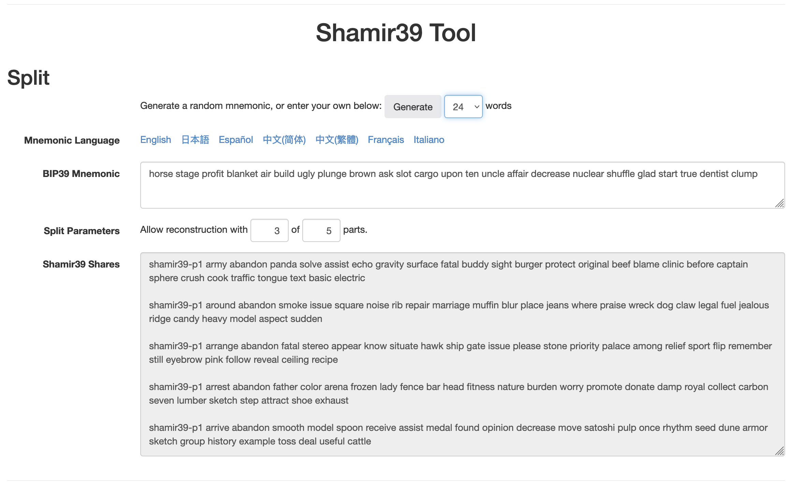
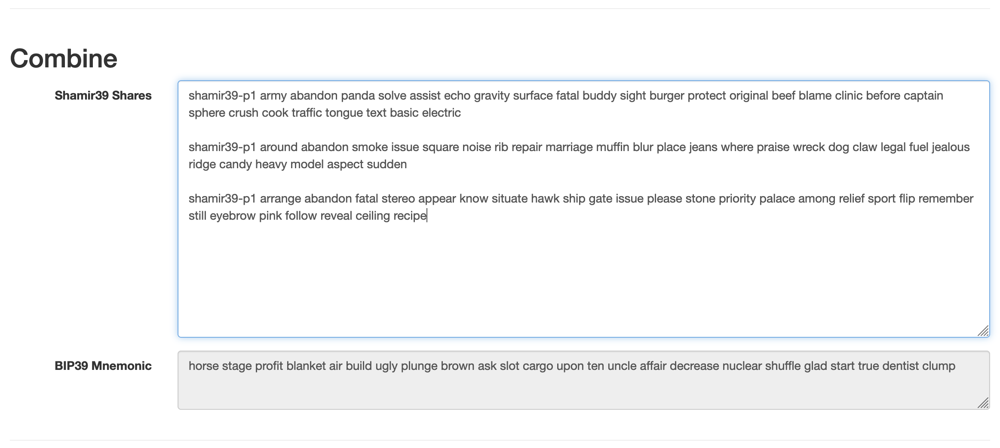
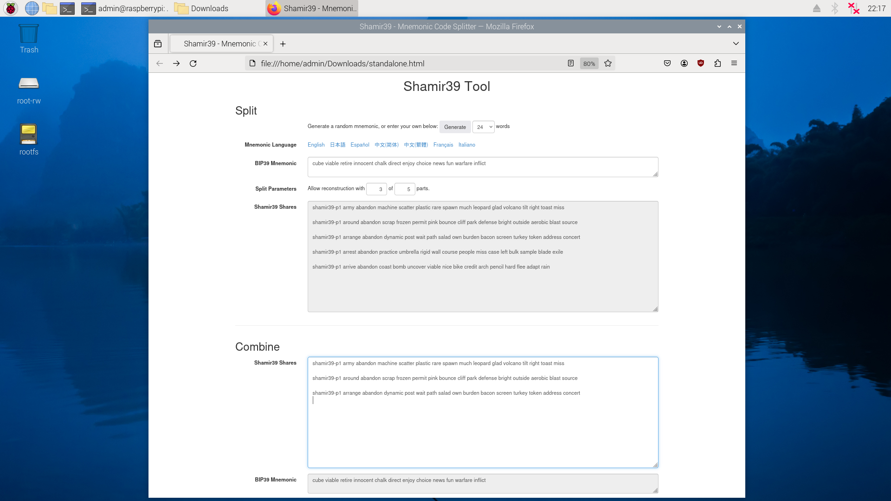

# Read-Only Offline Crypto Device Recipe

**Work in Progress**

If you hold, or will hold cryptocurrency, you will eventually search for a tool to distribute parts of your private keys to multiple locations or parties.

This guide is a recipe for you to build a read-only offline Raspberry Pi 400 device to split and combine your private keys, in the form of BIP-39 mnemonic seed phrases, using the [Shamir39 tool](https://github.com/iancoleman/shamir39).

 

## Table Of Contents

* [Overview](#overview)
* [Shopping List](#shopping-list)
  * [Raspberry Pi 400](#raspberry-pi-400)
  * [MicroSD Card](#microsd-card)
  * [USB-C Power Supply](#usb-c-power-supply)
  * [USB-A or USB-C Mouse](#usb-a-or-usb-c-mouse)
  * [Monitor With Micro HDMI Cable](#monitor-with-micro-hdmi-cable)
  * [Component Prices](#comonent-prices)
  * [Separate Computer And Wireless Internet](#separate-computer-and-wireless-internet)
* [Preparing The Raspberry Pi OS Installation MicroSD Card](#preparing-the-raspberry-pi-os-installation-microsd-card)
* [Building The Read-Only Offline Shamir39 Device](#building-the-read-only-offline-shamir39-device)
* [Using The Read-Only Offline Shamir39 Device](#using-the-read-only-offline-shamir39-device)
* [Risks](#risks)
* [Alternatives](#alternatives)
* [FAQs](#faqs)

 

---

## Overview

Many hardware and software wallets use [BIP-39 mnemonic seed phrases](https://bitcoinwiki.org/wiki/mnemonic-phrase) for the backup and recovery of the private keys.

  
  

One "safer" way to store the BIP-39 mnemonic seed phrases is to split them into **shares** using the **Shamir39** tool at https://iancoleman.io/shamir39/. These shares can then be distributed to multiple locations or parties for safekeeping, and combined when required to recover the original BIP-39 mnemonic seed phrases.

Here is an example of a BIP-39 mnemonic seed phrase split into 5 shares, with a minimum of 3 shares required to recover the original BIP-39 mnemonic seed phrase.

 

Here are the minimum three shares combined to recover the original BIP-39 mnemonic seed phrase.

 

The Shamir39 tool linked above should only be used with a computer permanently disconnected from any networks to prevent the leakage of any secrets.

This is a simple recipe to create a small **dedicated** **offline** **read-only** **Raspberry Pi 400** computer to run the Shamir39 tool in **standalone** mode.

When this device is being used, any changes to the file system is written to Random Access Memory (RAM) instead of the MicroSD card storage, and these changes will be lost when the device loses power.

Please see [Risks](#risks) before any serious use.

 

---

## Shopping List

See [Hardware](Hardware.md).

 

---

## Preparing The Raspberry Pi OS Installation MicroSD Card

See [Storage Preparations](StoragePreparation.md).

 

---

## Building The Read-Only Offline Shamir39 Device

See [Installation](Installation.md).

 

---

## Using The Read-Only Offline Shamir39 Device

Boot your machine and load `standalone.html` from your Downloads folder to use Shamir39 offline to split or combine your keys. Power off and all your secrets on the device are forgotten.

 

---

## Risks

### Shamir39 Tool

The [Shamir39 tool](https://iancoleman.io/shamir39/) could have some weaknesses in the algorithms, or in the implementation of the algorithms. Please carefully read the warnings messages in this tool.

#### Recoverability Of Original Keys

To be fully confident that you can recover your original BIP-39 mnemonic seed phrase from your shares, manually test the different combinations in this same tool.

#### Randomness

Use your hardware wallet to generate your BIP-39 mnemonic seed phrase in preference to using the `Generate` button in this Shamir39 tool. This will reduce any risks in case of vulnerabilities in the random number generation process using this Shamir39 tool.

#### Algorithm Not Standardised

The Shamir39 tools does not use a standardised algorithm and there is no alternative implementation.

When splitting important keys using this tool, remember to keep several "backups" of this offline Shamir39 devices.

The main backups are copies of your offline Shamir39 MicroSD card.

Having the Raspberry Pi hardware backup is slightly less important, as you can use your MicroSD card in any readily available Raspberry Pi Model 4 series.

Also keep good documentation as you may only access these devices and MicroSD cards very infrequently.

#### Hope And Pray

Hope and pray that there are no serious vulnerabilities in the Shamir39 and Shamirs Secret Sharing algorithms, and this implementation.

 

### Hardware

#### Computer Monitor HDMI Connection

The signals from the Micro HDMI connection of this device to your computer monitor can leak your secrets. Only use computer monitors, cables and adaptors that your trust "enough".

#### Keyboard

The reason why the Raspberry Pi 400 is chosen for this recipe is because you do not have to connect an external keyboard to your offline device. If you are using one of the [Alternatives](#alternatives) requiring a keyboard, the signals from your keyboard can [leak your secrets](https://www.amazon.com.au/AirDrive-Keylogger-Hardware-Wi-Fi-memory/dp/B073XRXP3S). Only use keyboards and adaptors that you trust "enough".

 

---

## Alternatives

[Raspberry Pi models 4 and B](https://www.raspberrypi.com/products/) may also work. You may need a [**case**](https://www.raspberrypi.com/products/case/), and a USB-A or USB-C keyboard.

  
  

Similar steps can be used to build this device on [other platforms](https://www.zdnet.com/article/best-raspberry-pi-alternative/) using the Ubuntu (or similar Linux) operating system.

 

---

## FAQs

Moved to [FAQs.md](FAQs.md).

 

 

Enjoy!

© Bok Consulting Pty Ltd 2024, CC0-1.0 license
